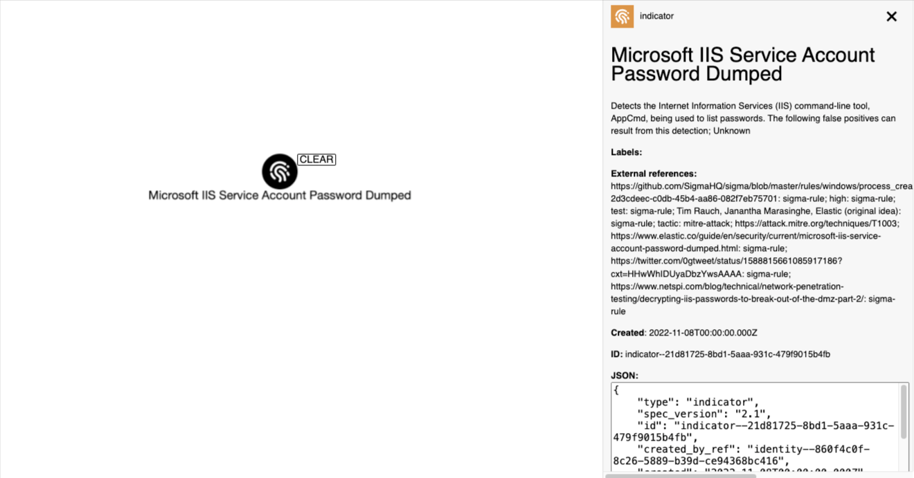

# sigma2stix

## Overview



A command line tool that converts Sigma Rules into STIX 2.1 Objects

## tl;dr

[](https://www.youtube.com/watch?v=xDA1zVR8LQA)

[Watch the demo](https://www.youtube.com/watch?v=xDA1zVR8LQA).

## Overview

> Sigma is a generic and open signature format that allows you to describe relevant log events in a straightforward manner. The rule format is very flexible, easy to write and applicable to any type of log file.

[SigmaHQ/sigma](https://github.com/SigmaHQ/sigma)

Sigma Rules are written in a YAML format, and distributed as YAML files.

The public rules (approved by the Sigma team) are stored in the main Sigma repository, nested in the `rules*` directories, e.g.

`rules-emerging-threats/2023/Exploits/CVE-2023-20198/cisco_syslog_cve_2023_20198_ios_xe_web_ui.yml`

https://github.com/SigmaHQ/sigma/blob/master/rules-emerging-threats/2023/Exploits/CVE-2023-20198/cisco_syslog_cve_2023_20198_ios_xe_web_ui.yml

Here at Signals Corps, most of the data we deal with is in STIX 2.1 format. This is because downstream threat intelligence tools understand STIX.

Therefore sigma2stix works by converting Sigma Rules to STIX 2.1 objects.

sigma2stix provides two modes:

1. downloads the latest rules from the [SigmaHQ/sigma repository](https://github.com/SigmaHQ/sigma) and converts each rule into a range of STIX objects
2. accepts a Sigma rule in a YAML file and converts to a STIX indicator object

## Installing the script

To install sigma2stix;

```shell
# clone the latest code
git clone https://github.com/muchdogesec/sigma2stix
# create a venv
cd sigma2stix
python3 -m venv sigma2stix-venv
source sigma2stix-venv/bin/activate
# install requirements
pip3 install -r requirements.txt
```

### Configuration options

sigma2stix has various settings that are defined in an `.env` file.

To create a template for the file:

```shell
cp .env.example .env
```

To see more information about how to set the variables, and what they do, read the `.env.markdown` file.


## Running the script

### Mode 1: SigmaHQ/sigma repository -> STIX

```shell
python3 sigma2stix.py \
	--mode sigmahq \
	--sigma_version_tag XXXX
```

Where;

* `mode` (required): should always be `sigmahq` if you want to download the latest rules from the [SigmaHQ/sigma repository](https://github.com/SigmaHQ/sigma)
* `sigma_version_tag` (optional): is the name of the tag in the SigmaHQ/sigma repository ([tags listed here](https://github.com/SigmaHQ/sigma/releases)), e.g. `r2023-08-24`. If no value passed, the master branch will be cloned.

Note this script only supports Sigma Rule version tags in the format `rYYYY-MM-DD`.

On each run all objects will be regenerated in the `stix2_objects` directory

#### Example 1.1: Download latest (master)

```shell
python3 sigma2stix.py \
	--mode sigmahq
```

#### Example 1.2: Download specific version

```shell
python3 sigma2stix.py \
	--mode sigmahq \
	--sigma_version_tag r2023-08-24
```

### Mode 2: SigmaHQ YAML file -> STIX

```shell
python3 sigma2stix.py \
	--mode sigmayaml \
	--file PATH/TO/FILE.yaml
```

Where;

* `mode` (required): should always be `sigmayaml` if you want to convert a local YAML file
* `file` (required): is the path to the YAML file containing only the Sigma Rule

On each run all objects will be regenerated in the `stix2_objects` directory

#### Example 2.1: Convert a local rule

```shell
python3 sigma2stix.py \
	--mode sigmayaml \
	--file tests/demo_rule.yml
```

## Mapping information

Here is how sigma2stix maps data to STIX objects from each Sigma Rules YAML.

Note, the Sigma specification defines the attributes that can be found in the YAML files, and some of the taxonomies used for the properties to populate them. [View the specification here](https://sigmahq.io/sigma-specification/).

At a high-level the STIX objects created are linked as shown here;

https://miro.com/app/board/uXjVKpPwTfA=/

### Marking Definition / Identity

These are hardcoded and imported from our [stix4doge repository](https://github.com/muchdogesec/stix4doge). Specifically these objects;

* Marking Definition: https://raw.githubusercontent.com/muchdogesec/stix4doge/main/objects/marking-definition/sigma2stix.json
* Identity: https://raw.githubusercontent.com/muchdogesec/stix4doge/main/objects/identity/sigma2stix.json

### Indicators

The core object created to represent a rule.

```json
{
    "type": "indicator",
    "spec_version": "2.1",
    "id": "indicator--<UUID V5>",
    "created_by_ref": "<IMPORTED IDENTITY>",
    "created": "<SIGMA RULE DATE FIELD, IF NONE SCRIPT RUN TIME>",
    "modified": "<SIGMA RULE MODIFIED FIELD, IF NONE SCRIPT CREATED>",
    "indicator_types": [
        "malicious-activity",
        "anomalous-activity"
    ],
    "name": "<SIGMA RULE TITLE>",
    "description": "<SIGMA RULE DESCRIPTION>. The following false positives can result from this detection; <SIGMA RULE FALSE POSITIVES [N]>",
    "pattern": "<ENTIRE SIGMA RULE YAML>",
    "pattern_type": "sigma",
    "valid_from": "<CREATED TIME>",
    "external_references": [
        {
            "source_name": "sigma-rule",
            "url": "<GITHUB LINK TO RULE> / <PATH TO FILE>"
        },
        {
            "source_name": "sigma-rule",
            "external_id": "id",
            "description": "<SIGMA RULE ID>"
        },
        {
            "source_name": "sigma-rule",
            "external_id": "reference",
            "description": "<SIGMA RULE REFERENCE [N]>"
        },
        {
            "source_name": "sigma-rule",
            "external_id": "level",
            "description": "<SIGMA RULE LEVEL>"
        },
        {
            "source_name": "sigma-rule",
            "external_id": "status",
            "description": "<SIGMA RULE STATUS>"
        },
        {
            "source_name": "sigma-rule",
            "external_id": "author",
            "description": "<SIGMA RULE AUTHOR [N]>"
        },
        {
            "source_name": "mitre-attack",
            "external_id": "tactic",
            "description": "<SIGMA RULE TAG ATT&CK TACTIC [N]>"
        },
        {
            "source_name": "mitre-attack",
            "external_id": "technique",
            "description": "<SIGMA RULE TAG ATT&CK TECHNIQUE [N]>"
        },
        {
            "source_name": "mitre-attack",
            "external_id": "technique",
            "description": "<SIGMA RULE TAG ATT&CK TECHNIQUE [N]>"
        },
        {
            "source_name": "sigma-rule",
            "external_id": "detection",
            "description": "<SIGMA RULE DETECTION TAG [N]>"
        },
        {
            "source_name": "cve",
            "external_id": "<SIGMA RULE CVE TAG [N]>",
            "description": "https://nvd.nist.gov/vuln/detail/<SIGMA RULE CVE TAG [N]>",
        }
    ],
    "object_marking_refs": [
        "marking-definition--94868c89-83c2-464b-929b-a1a8aa3c8487",
        "<IMPORTED MARKING DEFINITION>"
    ]      
}
```

The UUID part of the rule is generated using the namespaces `860f4c0f-8c26-5889-b39d-ce94368bc416` and the Sigma Rule `id+pattern_type` (from STIX object).

e.g. namespace = `860f4c0f-8c26-5889-b39d-ce94368bc416` and value = `d9365e39-febd-4a4b-8441-3ca91bb9d333+sigma` = `04f2c0c4-8cc8-5471-a71c-f8b7c0da0c06` = `indicator--04f2c0c4-8cc8-5471-a71c-f8b7c0da0c06`

### Relationships

Note, a Sigma Rules can also contain a `related` property, that links it to another rule. For example,

```yaml
related:
    - id: f305fd62-beca-47da-ad95-7690a0620084
      type: similar
```

Or an example with two relationships;

```yaml
related:
    - id: 455b9d50-15a1-4b99-853f-8d37655a4c1b
      type: similar
    - id: 75df3b17-8bcc-4565-b89b-c9898acef911
      type: obsoletes
```

Where the `related` property with an `id` and `type` is found in a rule (as noted above, could be many), a STIX relationship object is also created to link the two rules as follows;

```json
{
    "type": "relationship",
    "spec_version": "2.1",
    "id": "relationship--<UUIDV5 GENERATION LOGIC>",
    "created_by_ref": "<IMPORTED IDENTITY>",
    "created": "<CREATED FIELD OF SOURCE INDICATOR OBJECT>",
    "modified": "<MODIFIED FIELD OF SOURCE INDICATOR OBJECT>",
    "relationship_type": "<RELATED.TYPE VALUE>",
    "source_ref": "indicator--<ID OF OBJECT WITH RELATED FIELD>",
    "target_ref": "indicator--<RELATED FIELD ID>",
    "object_marking_refs": [
        "marking-definition--94868c89-83c2-464b-929b-a1a8aa3c8487",
        "<IMPORTED MARKING DEFINITION>"
    ]
}
```

To generate the id of the SRO, a UUIDv5 is generated using the namespace `860f4c0f-8c26-5889-b39d-ce94368bc416` and `source_ref+target_ref` (e.g, `indicator--0ec4f75f-74c1-4f66-a6d0-f488b20072f1+indicator--4c188857-cbcd-4c76-98e4-90fc2f5a6ddf`) = `13bb8925-d991-551b-bd00-05c45a85df2c` = `relationship--13bb8925-d991-551b-bd00-05c45a85df2c`

Note, in `--mode sigmayaml`, no relationship objects are created.

### Grouping

The path to each rule (directory structure) also holds some significance, and should be represented as STIX 2.1 Grouping objects.

```json
{
    "type": "grouping",
    "spec_version": "2.1",
    "id": "grouping--<UUID V5>",
    "created_by_ref": "<IDENTITY IMPORTED>",
    "created": "<EARLIEST CREATED TIME OF OBJECT IN BUNDLE>",
    "modified": "<LATEST CREATED TIME OF OBJECT IN BUNDLE>",
    "name": "<DIRECTORY PATH>",
    "context": "suspicious-activity",
    "object_refs": [
        "indicator--<ID OF RULE IN DIRECTORY>",
        "indicator--<ID OF RULE IN DIRECTORY>"
    ],
    "object_marking_refs": [
        "marking-definition--94868c89-83c2-464b-929b-a1a8aa3c8487",
        "<IMPORTED MARKING DEFINITION>"
    ]
}
```

To generate the id of the SRO, a UUIDv5 is generated using the namespace `860f4c0f-8c26-5889-b39d-ce94368bc416` and `name` property. e.g. `rules-threat-hunting/windows/file/file_event` = `c973b2fe-8bc9-5c4a-9172-7ec6542600d7` = `grouping--c973b2fe-8bc9-5c4a-9172-7ec6542600d7`

For example, this directory path holds 3 rules: https://github.com/SigmaHQ/sigma/tree/master/rules-threat-hunting/windows/file/file_event, and thus 3 `object_refs` would exist in the grouping object representing it.

Note, in `--mode sigmayaml`, no grouping objects are created.

### MITRE ATT&CK

Inside some Indicators for Sigma Rules are labels with ATT&CK tags. e.g.

```
    "labels": [
        "attack.T1055",
        "attack.T1055.011",
        "attack.S0039"
    ]
```

The labels identifying ATT&CKs always start with attack. followed by the ATT&CK ID.

These are then converted into the ATT&CK ID (e.g. `attack.T1055` -> `T1055`) and looked up using the CTI Butler endpoints;

```shell
GET /api/v1/attack-enterprise/objects/{attack_id}/
GET /api/v1/attack-ics/objects/{attack_id}/
GET /api/v1/attack-mobile/objects/{attack_id}/
```

The objects returned are imported to the final bundle, and then linked to the Indicator object representing the rule as follows;

```json
{
    "type": "relationship",
    "spec_version": "2.1",
    "id": "relationship--<UUID V5 LOGIC>",
    "created_by_ref": "<IMPORTED IDENTITY OBJECT>",
    "created": "<indicator.created>",
    "modified": "<indicator.modified>",
    "relationship_type": "detects",
    "source_ref": "indicator--<SIGMA INDICATOR STIX OBJECT>",
    "target_ref": "<ATT&CK STIX OBJECT>",
    "description": "<SIGMA RULE NAME> <relationship_type without - char> <ATT&CK name>",
    "object_marking_refs": [
        "marking-definition--94868c89-83c2-464b-929b-a1a8aa3c8487",
        "<MARKING DEFINITION IMPORTED>"
    ]
}
```

To generate the id of SRO, a UUIDv5 is generated using the namespace `860f4c0f-8c26-5889-b39d-ce94368bc416` and the `relationship_type+source_ref+target_ref` values.

### CVEs

Inside some Indicators for Sigma Rules are labels with CVE tags. e.g.

```txt
    "labels": [
        "cve.2021.44228"
    ]
```

The labels identifying CVEs always start with cve. followed by the CVE ID where the - is replaced with a .. e.g. `cve.2021.44228` is refering to `CVE-2021-44228` and looked up using the CTI Butler CVE endpoint;

```shell
GET /api/v1/cve/objects/{cve_id}/
```

The objects returned are imported to the final bundle, and then linked to the Indicator object representing the rule as follows;

```json
{
    "type": "relationship",
    "spec_version": "2.1",
    "id": "relationship--<UUID V5 LOGIC>",
    "created_by_ref": "<IMPORTED IDENTITY OBJECT>",
    "created": "<indicator.created>",
    "modified": "<indicator.modified>",
    "relationship_type": "detects",
    "source_ref": "indicator--<SIGMA INDICATOR STIX OBJECT>",
    "target_ref": "vulnerability--<CVE VULNERABILITY STIX OBJECT>",
    "description": "<SIGMA RULE NAME> <relationship_type without - char> <CVE name>",
    "object_marking_refs": [
        "marking-definition--94868c89-83c2-464b-929b-a1a8aa3c8487",
        "<MARKING DEFINITION IMPORTED>"
    ]
}
```

To generate the id of SRO, a UUIDv5 is generated using the namespace `860f4c0f-8c26-5889-b39d-ce94368bc416` and the `relationship_type+source_ref+target_ref` values.

### Bundle

sigma2stix also creates a STIX 2.1 Bundle JSON object containing all the other STIX 2.1 Objects created at each run. The Bundle takes the format;

```json
{
    "type": "bundle",
    "id": "bundle--<UUIDV5 GENERATION LOGIC>",
    "objects": [
        "<ALL STIX JSON OBJECTS>"
    ]
}
```

To generate the id of the SRO, a UUIDv5 is generated using the namespace `860f4c0f-8c26-5889-b39d-ce94368bc416` and `<MD5 HASH OF THE SORTED OBJECTS PAYLOAD IN BUNDLE JSON>`.

## Backfill old versions

You can use the following script to get a bundles of rules for every Sigma version published

```shell
sh utilities/backfill_all.sh
```

If you only want the latest version bundle, just run the last line of `utilities/backfill_all.sh` in your terminal.

## Useful supporting tools

* To generate STIX 2.1 Objects: [stix2 Python Lib](https://stix2.readthedocs.io/en/latest/)
* The STIX 2.1 specification: [STIX 2.1 docs](https://docs.oasis-open.org/cti/stix/v2.1/stix-v2.1.html)
* [SigmaHQ on GitHub](https://github.com/SigmaHQ)

## Support

[Minimal support provided via the DOGESEC community](https://community.dogesec.com/).

## License

[Apache 2.0](/LICENSE).